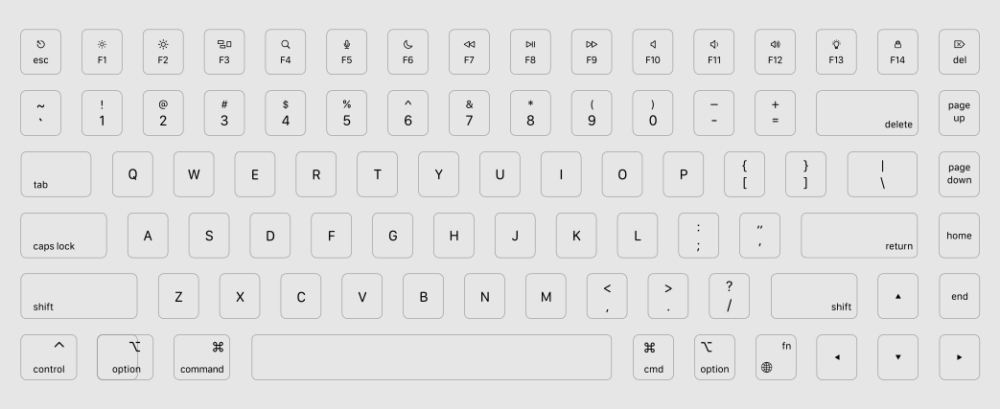

# ANSI Mac layout for WASD v5

After a lot of searching for KBD75/YMD75 keycaps with Mac legends, I decided to create my own layout.

I tried to mimic Apple's M1 Macbook Air (2020) keyboard as closely as possible but KBD75 has 1u keys to the right of the spacebar.

- New F4 (spotlight), F5 (dictation), and F6 (Do not disturb) icons
- F13 with bulb icon for any custom lighting toggles
- F14 with a lock icon for locking the laptop
- FN key with globe (emoji finder)
- Added escape icon ⎋

